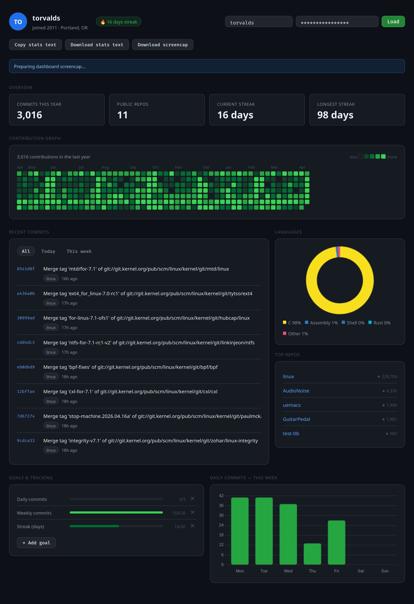

# GitHub Dashboard

A clean, shareable view of a GitHub profile.

This dashboard lets you quickly check activity, streaks, languages, top repos, and recent commits, then share the results as text or an image.

## What You Can Do

- Load any GitHub username
- View yearly contributions and activity heatmap
- See current and longest streaks
- Review recent commits
- Check top languages and top repositories
- Track simple personal goals
- Share stats by:
  - copying text
  - downloading a text summary
  - downloading a screencap

## Quick Start

1. Open `github-dashboard.html` in your browser.
2. Enter a GitHub username.
3. Click **Load**.

Optional: add a GitHub token for more reliable and accurate results.

## GitHub Token (Optional, Recommended)

Using a token helps with:

- better reliability
- fewer API limit issues
- more accurate contribution totals

The token is saved in your browser for convenience and is masked when exporting screencaps.

## Sharing Stats

Use the share buttons at the top of the dashboard:

- **Copy stats text**
- **Download stats text**
- **Download screencap**

## If Something Looks Off

- Add a token if totals seem too low.
- Try reloading if GitHub rate limits are hit.
- Some profiles may show limited commit info if recent public activity is low.

## File

- `github-dashboard.html` - complete app in one file
